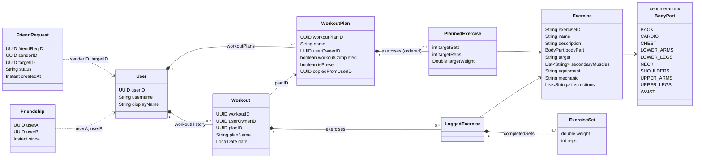

# Entity class diagram

```mermaid
classDiagram
    direction LR

    class User {
        UUID userID
        String username
        String displayName
    }
    class WorkoutPlan {
        UUID workoutPlanID
        String name
        UUID userOwnerID
        boolean workoutCompleted
        boolean isPreset
        UUID copiedFromUserID
    }
    class PlannedExercise {
        int targetSets
        int targetReps
        Double targetWeight
    }
    class Exercise {
        String exerciseID
        String name
        String description
        BodyPart bodyPart
        String target
        List~String~ secondaryMuscles
        String equipment
        String mechanic
        List~String~ instructions
    }
    class BodyPart {
        <<enumeration>>
        BACK
        CARDIO
        CHEST
        LOWER_ARMS
        LOWER_LEGS
        NECK
        SHOULDERS
        UPPER_ARMS
        UPPER_LEGS
        WAIST
    }
    class Workout {
        UUID workoutID
        UUID userOwnerID
        UUID planID
        String planName
        LocalDate date
    }
    class LoggedExercise
    class ExerciseSet {
        double weight
        int reps
    }
    class FriendRequest {
        UUID friendReqID
        UUID senderID
        UUID targetID
        String status
        Instant createdAt
    }
    class Friendship {
        UUID userA
        UUID userB
        Instant since
    }

    User "1" *-- "0..*" WorkoutPlan : workoutPlans
    User "1" *-- "0..*" Workout : workoutHistory
    WorkoutPlan "1" *-- "0..*" PlannedExercise : exercises (ordered)
    PlannedExercise --> Exercise
    Exercise --> BodyPart
    Workout "1" *-- "0..*" LoggedExercise : exercises
    LoggedExercise --> Exercise
    LoggedExercise "1" *-- "0..*" ExerciseSet : completedSets

    %% ID-only references (no object link)
    Workout ..> WorkoutPlan : planID
    FriendRequest ..> User : senderID, targetID
    Friendship ..> User : userA, userB
```
